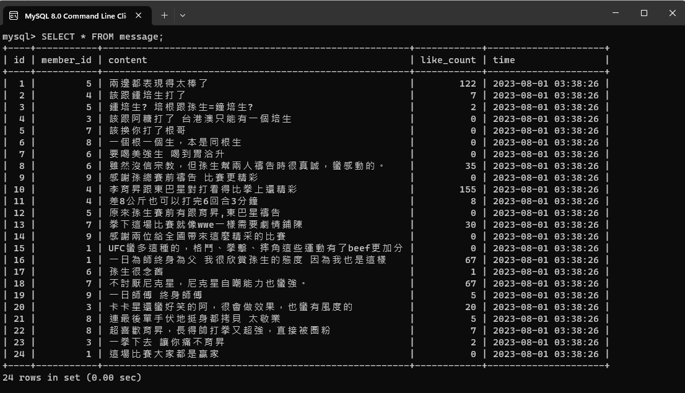
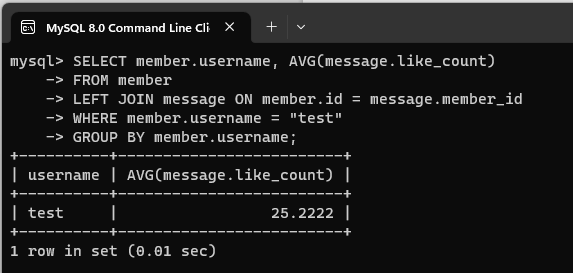

<h2> 要求三</h2>
<ol>
  <li><h3>新增資料到 member 的資料表</h3></li>
  
  <li><h3>使⽤ SELECT 指令取得所有在 member 資料表中的會員資料</h3></li>
  
  <li><h3>使⽤ SELECT 指令取得所有在 member 資料表中的會員資料，並按照 time 欄位，由近到遠排序。</h3></li>
  
  <li><h3>使⽤ SELECT 指令按照 time 欄位，由近到遠排序，並取得所有在 member 資料表中排序後的第 2 ~ 4 筆會員資料。</h3></li>
  
  <li><h3>使⽤ SELECT 指令取得欄位 username 是 test 的會員資料。</h3></li>
  
  <li><h3>使⽤ SELECT 指令取得欄位 username 是 test、且欄位 password 也是 test 的資料。</h3></li>
  
  <li><h3>使⽤ UPDATE 指令將 username 是 test 的會員資料的 name 欄位改成 test2。</h3></li>
  
</ol>

<h2> 要求四</h2>
<ol>
  <li><h3> 取得 member 資料表中，總共有幾筆資料 ( 幾位會員 )。</h3></li>
  
  
  <li><h3> 取得 member 資料表中，所有會員 follower_count 欄位的總和。</h3></li>
  
  <li><h3> 取得 member 資料表中，所有會員 follower_count 欄位的平均數。</h3></li>
  
</ol>

<h2> 要求五</h2>
<ol>
  <h3> 補充：將CSV檔案匯入到MySQL的資料庫當中</h3>
  
  <li><h3> 使⽤ SELECT 搭配 JOIN 語法，取得所有留⾔，結果須包含留⾔者的姓名。</h3></li>
  
  <li><h3> 使⽤ SELECT 搭配 JOIN 語法，取得 member 資料表中欄位 username 是 test 的所有留⾔，資料中須包含留⾔者的姓名。</h3></li>
  
  <li><h3> 使⽤ SELECT、SQL Aggregate Functions 搭配 JOIN 語法，取得 member 資料表中欄位 username 是 test 的所有留⾔平均按讚數。</h3></li>
  
</ol>
